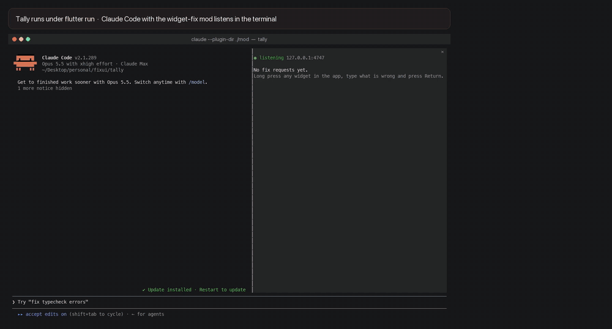

# WidgetFix

[English](README.md) | [O'zbekcha](README.uz.md) | **Русский**

Зажмите любой виджет вашего Flutter-приложения в debug-сборке, напишите, что не так, и нажмите Return. Отчёт попадёт в сессию Claude Code, которая уже запущена в вашем проекте: виджет, строка Dart-кода, которая его создала, скриншот и ваш комментарий. Claude исправит код и сделает hot reload приложения, а баннер в приложении покажет весь путь исправления — от постановки в очередь до появления на экране.



[Смотреть демо в полном качестве (MP4, 70 с)](docs/demo.mp4). Оно записано вживую: сессия Claude Code с модом исправила по отчётам четыре специально заложенных бага в Tally. Ускорены только паузы ожидания.

WidgetFix — это порт [FixKit](https://github.com/ostiums/fixkit) на Flutter; FixKit делает то же самое для SwiftUI-приложений в симуляторе iOS.

WidgetFix состоит из двух частей:

- **мод widget-fix** для Claude Code принимает отчёты;
- **Dart-пакет widget_fix** отправляет их из debug-сборки. В release- и profile-сборках он вырезается при компиляции.

## Требования

- Claude Code 2.1.287 или новее.
- Node.js 18.2 или новее: на нём работает ресивер мода.
- Flutter 3.32 или новее. WidgetFix работает в симуляторе iOS, эмуляторе Android, десктопном приложении и Flutter web, а также на телефоне, с которого доступен ресивер (см. [Устройства](#устройства)).
- Больше ничего не нужно. Версии для iOS требовался AXe, чтобы читать дерево доступности симулятора; debug-сборка Flutter знает, какая строка создала каждый виджет, поэтому приложение само сообщает это ресиверу.

## Установка

### 1. Мод

```bash
claude plugin marketplace add ushodmonov/widget_fix
claude plugin install widget-fix@widget-fix
```

После этого мод загружается в каждой сессии Claude Code, но отчёты принимает только сессия, запущенная во Flutter-проекте, чей `pubspec.yaml` зависит от `widget_fix`: при старте сессии он запускает свой ресивер на `127.0.0.1:4747`, а при её завершении останавливает его. Сессии в других папках отчёты не трогают.

### 2. Пакет

```yaml
dependencies:
  widget_fix:
    git:
      url: https://github.com/ushodmonov/widget_fix
      path: packages/widget_fix
```

Это обычная зависимость, а не dev-зависимость: приложение импортирует пакет. В release-сборке от него остаётся лишь несколько проверок `kDebugMode`, которые компилятор удаляет.

### 3. Одна строка в приложении

```dart
import 'package:widget_fix/widget_fix.dart';
import 'package:flutter/material.dart';

class MyApp extends StatelessWidget {
  const MyApp({super.key});

  @override
  Widget build(BuildContext context) {
    return MaterialApp(
      builder: WidgetFix.builder,
      home: const HomePage(),
    );
  }
}
```

Вот и вся интеграция. `CupertinoApp` и `WidgetsApp` принимают такой же `builder`. Если у приложения уже есть свой builder, оберните то, что он возвращает: `builder: (context, child) => WidgetFixHost(child: MyFrame(child: child!))`. Что делает хост, объясняется в следующем разделе.

### 4. Папка проекта

Мод записывает отчёты в `.widget_fix/` в той папке, где запущен `claude`, поэтому запускайте его в корне Flutter-проекта, в папке с `pubspec.yaml`, и добавьте `.widget_fix/` в `.gitignore`. Чтобы Claude мог открывать скриншоты и перезагружать приложение, не спрашивая каждый раз, разрешите и то и другое в настройках Claude Code для проекта:

```json
{
  "permissions": {
    "allow": [
      "Read(./.widget_fix/**)",
      "Bash(pkill -USR1 -F .widget_fix/flutter.pid)",
      "Bash(pkill -USR2 -F .widget_fix/flutter.pid)"
    ]
  }
}
```

### 5. Запустите приложение так, чтобы Claude мог его перезагружать

```bash
flutter run --pid-file .widget_fix/flutter.pid
```

`flutter run` делает hot reload по сигналу `SIGUSR1` и hot restart по `SIGUSR2`. Когда pid-файл лежит в `.widget_fix/`, Claude сам перезагружает приложение, как только исправление записано: `pkill -USR1 -F .widget_fix/flutter.pid`. Это одна простая команда, поэтому её покрывает правило allow выше; `kill -USR1 $(cat …)` запрашивала бы разрешение каждый раз, потому что Claude Code не может проверить вложенную команду до её запуска. Если же к сессии подключён [Dart MCP-сервер](https://docs.flutter.dev/ai/mcp-server), Claude использует его инструмент `hot_reload`. Если нет ни того ни другого, Claude сообщит, что для изменения нужен hot reload, и вы нажмёте `r`.

## Почему `WidgetFix.builder` передаётся в builder приложения

Пока хост не запущен, пакет ничего не делает. `MaterialApp.builder` помещает его над навигатором, поэтому он охватывает все маршруты, диалоги и шторки. Хост выполняет пять задач:

- **Долгое нажатие.** Хост слушает сырые pointer-события вокруг приложения, параллельно с собственными жестами приложения: кнопки, списки и скроллы продолжают работать. Если нажатие полсекунды остаётся неподвижным, оно переходит к WidgetFix, и тот отменяет указатель для всех остальных, чтобы кнопка под пальцем не сработала заодно.
- **Поиск виджета.** Хост выполняет hit test в точке нажатия и поднимается вверх от виджета под пальцем. Отслеживание создания виджетов во Flutter (widget creation tracking), включённое в каждой debug-сборке `flutter run`, показывает, какая строка собственного кода приложения создала каждый виджет: нажатый `Text`, ряд, в котором он стоит, и виджет из другого файла, разместивший этот ряд. Виджеты из Flutter, из pub cache и из самого WidgetFix пропускаются.
- **Окно комментария.** Хост затемняет экран, подсвечивает нажатый виджет и показывает поле комментария над клавиатурой. Если клавиатура закрыла бы виджет, он сдвигает приложение вверх. Пока окно комментария открыто, приложение сохраняет прежний размер экрана, чтобы клавиатура не перестраивала его раскладку под подсветкой.
- **Баннеры.** Хост показывает ход обработки отчёта вверху экрана: отправлен, в очереди, исправляется, перезагружается, исправлен.
- **Сигнал о перезагрузке.** При каждом запуске и каждом hot reload хост сообщает ресиверу, что код приложения обновился. Именно по перезагрузке, случившейся, пока Claude работает над отчётом, мод узнаёт, что исправление уже на экране, — неважно, послал ли Claude сигнал `flutter run`, воспользовался Dart MCP-сервером или вы сами нажали `r`. Hot reload сохраняет состояние приложения, поэтому экран, с которого вы отправили отчёт, остаётся открытым.

В release- или profile-сборке `WidgetFix.builder` возвращает приложение без изменений, а поскольку `kDebugMode` — константа, компилятор выбрасывает вместе с ним и весь остальной WidgetFix. `scripts/test.sh` проверяет, что в release-сборке Tally от него ничего не осталось.

## Использование `Fixable`

Размечать ничего не обязательно. Без меток отчёт называет виджет под пальцем и строку, которая его создала:

```
Income should be green

[fix r1] Text "+€4,650.00" · lib/features/home/transaction_row.dart:50 · in TransactionRow at lib/features/activity/activity_view.dart:93 · near "Salary, September", "Northwind GmbH" · Activity screen · .widget_fix/reports/r1.png
```

`in … at` — ближайший охватывающий виджет из другого файла: для общего виджета это место, где его использовали. Пометьте виджет через `.fixable`, если хотите, чтобы отчёты о нём содержали имя и чтобы подсвечивался контейнер, а не текст под пальцем:

```dart
class WalletCardView extends StatelessWidget {
  @override
  Widget build(BuildContext context) {
    return Column(
      children: [
        Text(card.number).fixable('card.number'),
        Text(card.holder).fixable('card.holderName'),
      ],
    ).fixable('home.walletCard');
  }
}
```

`Fixable('card.number', child: Text(card.number))` — та же метка в развёрнутой форме. Что меняет метка:

- **Отчёт начинается с имени.** Строка кода в нём — та, что создаёт обёрнутый меткой виджет, поэтому Claude начинает читать с неё:

  ```
  [fix r2] card.holderName · lib/features/home/wallet_card_view.dart:43 · Text "Vladimir Berest…" · .widget_fix/reports/r2.png
  ```

- **Окно комментария подсвечивает рамку метки** вместе с промежутками между её дочерними виджетами и подписывает её именем и файлом. На скриншоте эта рамка обведена. Без метки подсвечивается нажатый виджет, если только он не занимает большую часть экрана, как фон; в таком случае вокруг пальца появляется кольцо.
- **Из вложенных меток выбирается самая внутренняя.** Нажатие на имя владельца из примера выше даёт отчёт с `card.holderName`, нажатие в любом другом месте карты — с `home.walletCard`.

Ставьте метку на тот виджет, чей код должен открыть Claude: на сам `Text`, если речь об опечатке или цвете, и на контейнер, если дело в отступах или вёрстке. Имя должно быть понятно только вам; в нём могут быть данные, как в `.fixable('transaction.amount.${transaction.merchant}')`. В release-сборке метка возвращает виджет без изменений.

`.fixScreen('Home')` или `FixScreen('Home', child: ...)` задаёт имя экрана. Отчёт берёт самое внутреннее имя экрана вокруг нажатого виджета, поэтому с `IndexedStack` или навигатором у каждого экрана может быть своё имя. Если у виджета нет метки, имя экрана попадает в отчёт в виде `Home screen`.

## Как пользоваться

1. Запустите `claude` в папке проекта. Панель Fix queue открывается в терминале шириной от 144 колонок; `/fix-queue` открывает её при любой ширине. Если отчёты проекта уже принимает другая сессия, эта переходит в режим ожидания и сообщает об этом; `/fix-take` переводит отчёты в неё.
2. Запустите приложение в debug-сборке: `flutter run --pid-file .widget_fix/flutter.pid`.
3. Зажмите виджет в приложении, напишите, что не так, и нажмите Return. Escape или тап по затемнённому экрану закрывает окно комментария.

Панель и баннер в приложении проходят статусы `queued`, `fixing`, `reloading` и `live`. Отчёт переходит в live, когда приложение перезагружается, пока Claude над ним работает, и остаётся live, если Claude завершает работу ответом. Отчёты, отправленные, пока Claude занят другим, ждут в очереди.

## Устройства

Приложение ищет ресивер по адресу `127.0.0.1:4747`, а на Android — ещё и по `10.0.2.2:4747`: под этим адресом эмулятор видит компьютер, на котором он запущен.

| Где запущено приложение | Что нужно |
| --- | --- |
| Симулятор iOS, эмулятор Android, Flutter web | ничего |
| Приложение для macOS | `com.apple.security.network.client` в `macos/Runner/DebugProfile.entitlements` |
| Android-телефон, подключённый по USB | `adb reverse tcp:4747 tcp:4747` |
| любой телефон в той же сети | `WIDGET_FIX_HOST=0.0.0.0` в окружении, в котором запускается `claude`, и `flutter run --dart-define=WIDGET_FIX_RECEIVER=http://<computer's address>:4747` |

`WIDGET_FIX_PORT` меняет порт с обеих сторон: для ресивера — через переменную окружения, для приложения — через `--dart-define`.

Окно комментария и баннеры используют иконки Material, которые входят в каждое приложение, созданное через `flutter create` (`uses-material-design: true`).

## Как это работает

```
app (WidgetFix) ──POST /report──▶ receiver (node, 127.0.0.1:4747) ──▶ .widget_fix/reports/<id>.png, <id>.json
      ▲                               │ one JSON line per report
      │ POST /launched, GET /status   ▼
      └── .widget_fix/status.json ◀── the mod: prompt, Fix queue pane, statuses
```

Когда срабатывает долгое нажатие, приложение выполняет hit test в этой точке, считывает места создания виджетов от нажатого до хоста, собирает тексты из того же ряда и делает скриншот всего, что находится под хостом, без окна комментария. Отчёт отправляется, как только введён комментарий. Ресивер сохраняет скриншот, а весь отчёт, включая полную цепочку виджетов, — в `.widget_fix/reports/<id>.json`, и передаёт отчёт моду. Мод отправляет промпт и добавляет в системный промпт раздел, который объясняет строку `[fix …]`. Статус каждого отчёта мод записывает в `.widget_fix/status.json`, а приложение периодически его опрашивает.

Ресивер принимает только JSON и отклоняет запросы с веб-страниц, если они загружены не с `localhost`, поэтому сайт, открытый в вашем браузере, не сможет вписывать промпты в сессию.

Отчёты принимает только одна сессия за раз, и она их удерживает: сессия, запущенная позже, видит, что порт 4747 занят, и ждёт, поэтому второй `claude` в том же проекте, открытый для побочного вопроса, не перехватывает отчёты приложения. `/fix-take` в этой сессии переводит отчёты в неё, а панель первой сессии показывает, куда они ушли. Перезагрузка мода в сессии, которая держит порт, оставляет его за ней.

## Пример: Tally

`tally/` — Flutter-порт SwiftUI-кошелька из оригинального FixKit с теми же четырьмя специально заложенными UI-багами; пакет из этого репозитория он подключает по пути.

```bash
git clone https://github.com/ushodmonov/widget_fix && cd widget_fix
./scripts/reset-demo.sh                  # puts the bugs back and runs Tally under flutter run
cd tally && claude --plugin-dir ../mod   # in another terminal: the mod from this checkout
```

| Где | Что зажать | Рабочий комментарий |
| --- | --- | --- |
| Home | кнопку Send | button is shifted |
| Home | кнопку Top up | corners don't match the others |
| Home или Cards | имя владельца карты | name is cut off |
| Home или Activity | сумму из зелёной категории, например зарплату | income should be green |

Каждый баг — ошибка в одну строку кода. Скрипт сброса восстанавливает их из git-тега `demo-start` — коммита, в котором они были внесены. Скрипт использует симулятор iPhone 18 Pro; чтобы указать другой симулятор или любое устройство из списка `flutter devices`, задайте переменную `DEVICE`.

## Записи по сценарию

Для записи экрана WidgetFix умеет воспроизводить отчёты по сценарию, а не по нажатиям пальцем. Соберите приложение с включённым режиссёром (director), а затем отдавайте шаги в виде JSON по адресу `http://127.0.0.1:4748/next`, по одному на запрос (204, если шагов нет):

```bash
flutter run --pid-file .widget_fix/flutter.pid --dart-define=WIDGET_FIX_DIRECTOR=true
```

```json
{"press": "card.holderName", "text": "The name is cut off"}
{"at": [321, 686], "text": "Income should be green"}
{"scroll": 260}
```

Нажатие открывает окно комментария на виджете `Fixable`, который виден на экране, или в заданной точке, вводит текст буква за буквой и отправляет его. Прокрутка сдвигает вертикальный скролл в середине экрана. У шага `defaults` из SwiftUI-версии аналога нет: hot reload сохраняет состояние приложения, так что восстанавливать вкладку не нужно.

## Разработка

`scripts/test.sh` запускает все проверки: `claude plugin validate` для маркетплейса и мода, тесты мода (`claude plugin test mod`), тесты ресивера (`node --test`), `flutter analyze` и `flutter test` для пакета и Tally, а также release-сборку Tally, в которой не должно быть WidgetFix.

## Лицензия

MIT, см. [LICENSE](LICENSE).
